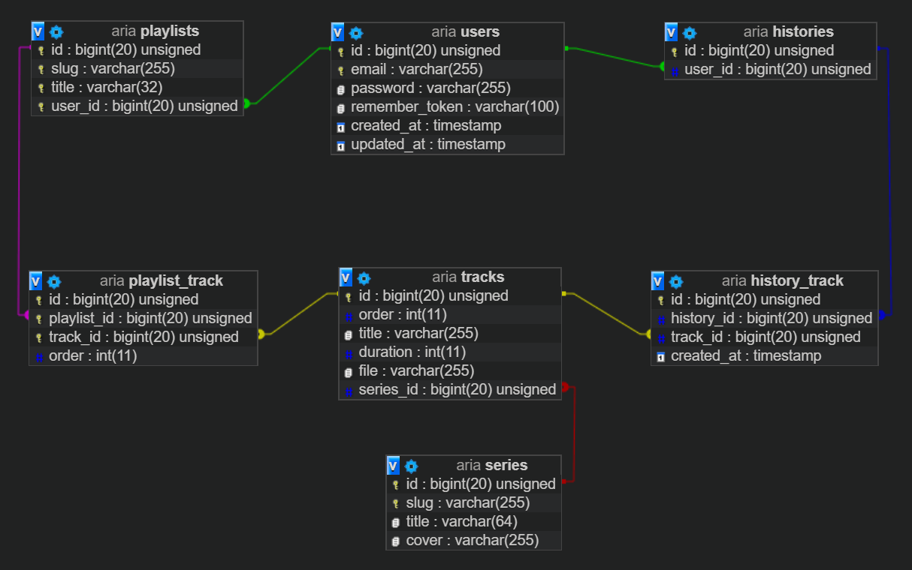
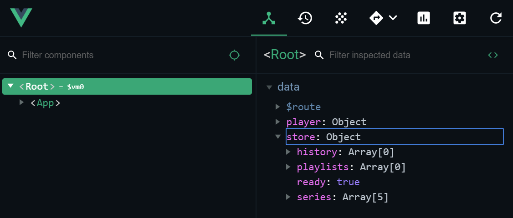
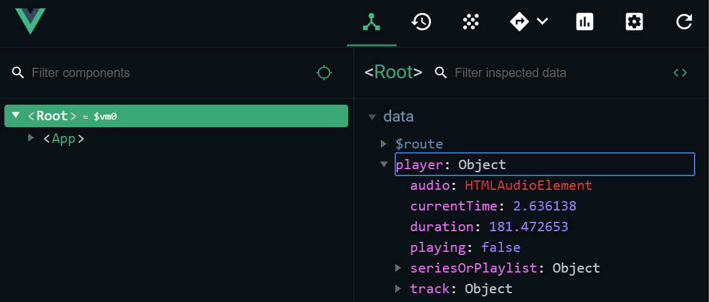

# Documentation

Aria is a modern web app that allows its users to stream soundtracks.
It is based on [Laravel](https://laravel.com/) and [Vue.js](https://vuejs.org/).

## Requirements

- PHP >= 7.3.0
- Apache >= 2.4.35
- MySQL >= 5.7.24
- Composer >= 1.10.5
- Node.js >= 12.5
- npm >= 6.9.0
- Evergreen browser (Chrome, Firefox, Edge Chromium)

[Laragon](https://laragon.org/) is recommended for local development.

## Setup

Clone this repository to your machine and set `/public` as the document root in your server configuration.

Now start your server (Apache and MySQL) and run the following commands:

```bash
npm install
composer install
npm run setup
```

Aria is now ready to run.

To build the frontend assets for production, run `npm run prod`.
To optimize Laravel for production, follow the [official docs](https://laravel.com/docs/7.x/deployment).

You may additionally install [Telescope](https://laravel.com/docs/6.x/telescope) for debugging:
```bash
php artisan telescope:publish
```

## Structure

Aria is roughly split into two parts:
- The Laravel backend, responsible for rendering the public pages and exposing a REST API...
- ...and the Vue.js SPA frontend, that encompases the actual music player and library.

All communication between these two parts happens via the API.
Incoming requests are first handled by [Laravel's router](https://laravel.com/docs/6.x/routing) (`/routes/web.php`), then deferred to the client side [Vue Router](https://router.vuejs.org/) (`/resources/spa/router.js`) if necessary.

Laravel's default [auth middleware](https://laravel.com/docs/6.x/authentication) is used to protect private routes.
Access to the API is limited via the [throttling middleware](https://laravel.com/docs/6.x/routing#rate-limiting).


## Database

All persistent data is stored in a MySQL database with this schema:



Database access happens through [Eloquent](https://laravel.com/docs/6.x/eloquent), Laravel's ORM.

## Store

Upon launching the SPA, the store singleton (`/resources/spa/Store.js`) fetches the user's data from the backend and stores it in memory.
It serves as a centralized, global source of truth.

Other components access data via its interface or direct mapping. The store is made *observable* via Vue.js – changes cause automatic updates of the UI.

The store syncs changes to the database lazily after updating the client side data. This makes the UI fast and responsive.

You may inspect the store inside the Vue.js devtools. It's attached to the root instance.



## Player

The player singleton (`/resources/spa/Player.js`) handles the audio playback and state.
Other components may access its data or use its interface to control the playback (play, pause, toggle, ...).
Just like the store, it is made *observable* via Vue.js and can be inspected inside the devtools.



## Event bus

Aria utilizes a simple event bus to emit global events inside the app. Components may subscribe to events and react to them.
Emitting and subscribing happens via the `$emit` and `$on` methods on the root instance.

```js
// emit
root.$emit("some-event", {some: "data"})

// subscribe
root.$on('some-event',e => someAction())
```
